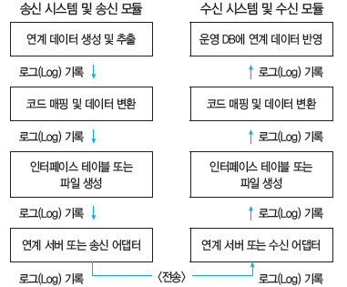

# 3. 통합 구현

## 통합 구현
- 사용자의 요구사항에 맞춰 송.수신 모듈과 중계 모듈간의 연계를 구현하는 것을 의미한다.
- 일반적인 통합 구현은 송수신 시스템과 모듈, 중계 시스템, 연계 데이터, 네티워크로 구성된다.

- 송신 시스템과 모듈
  * 송신 시스템은 데이터를 생성 및 변환하여 전송하는 시스템으로, 송신 모듈과 모니터링 기능으로 구성된다.
  * 송신 모듈은 전송 데이터를 생성하고 필요에 따라 전송 데이터의 변환 등을 수행한다.
  * 모니터링 기능은 전송 데이터의 생성부터 송신까지의 과정과 송신 상태등을 확인한다.
- 수신 시스템과 모듈
   * 수신 시스템은 수신 받은 데이터를 정제 및 변환하는 시스템으로, 수신 모듈과 모니터링 기능으로 구성된다.
   * 수신 모듈은 수신 데이터를 정제하고 애플리케이션이나 데이터베이스 테이블에 적합한 데이터로 변환하는 작업 등을 수행한다.
- 중계 시스템
   * 내 외부 시스템 간 또는 내부 시스템 간의 연계 시 사용되는 아키텍처이다.
- 연계 데이터
   * 송 수신 시스템 간 송 수신되는 데이터이다.
   * 연계 데이터에는 속성, 길이, 타입 등이 포함된다.
- 네트워크
   * 송신 시스템, 수신 시스템, 중계 시스템을 연결해주는 통신망이다.
  
## 연계 요구사항 분석
 - 통합 구현을 위해 사용자 요구사항을 분석하고 연계 데이터를 식별 및 표준화하여 연계 데이터를 정의하는 것이다.
 - 연계 요구사항 분석 절차
    1. 시스템 구성도, 응용 애플리케이션 구성 등을 통해 송수신 시스템의하드웨어 및 소프트웨어 구성, 네트워크 현황을 확인한다. 
      * 시스템 구성도 : 송수신 시스템의 하드웨어, 소프트웨어, 네티워크 구성 등을 정의한 문서
      * 응용 애플리케이션 구성 : 메뉴 구조, 화면 설계, 데이터의 발생 시점, 발생 유형, 발생 주기 등을 정의한 문서
    2. 송 수신 시스템과 연결할 데이터와 관련된 테이블 정의서, 코드 정의서 등의 문서를 확인한다.
      * 테이블 정의서 : 테이블에서 관리되는 컬럼들의 특징, 인덱스, 업무 규칙 등을 정의한 문서
      * 코드 정의서 : 데이터베이스에서 코드성 속성을 정의한 문서
    3. 확인된 시스템의 구성과 데이터 현황 정보 등을 기반으로 체크리스트를 작성한다.
    4. 시스템 구성도, 응용 애플리케이션 구성, 테이블 정의서, 코드 정의서, 체크리스트 등을 사용자, 시스템 관리자 등과 공유하고 인터뷰나 설문조사를 실시한다.
    5. 인터뷰나 설문조사를 통해 확인된 결과를 기반으로 요구사항의 ID, 이름, 유형, 설명, 해결 방안 등이 포함된 연계 요구사항 분석서를 작성한다.
  
## 연계 데이터 식별 및 표준화
 - 연계 데이터를 구성하기 위해 연계 데이터를 식별하고 식별된 연계 데이터를 표준화한 후 이를 기반으로 연계(인터페이스) 정의서를 작성한다.
 - 연계 데이터 식별 및 표준화 절차
    1. 연계 범위 및 항목 정의 : 데이터 타입, 길이, 코드화 여부 등 시스템 간 연계할 정보를 상세화하여 정의
    2. 연계 코드 변환 및 매핑 : 정보로 전환하거나 검색 조건으로 활용하기 위해, 연계 정보 중 코드로 관리되어야 할 항목을 찾아 코드로 변환
    3. 연계 데이터 식별자와 변경 구분 추가 : 수신 시스템의 연계 정보에 송신 시스템의 식별자, 추가, 수정, 삭제 중 어떤 조작을 수행하는지 
       식별해주는 구분 정보를 추가하고, 연계 데이터의 확인 및 모니터링을 위해 인터페이스 테이블 또는 파일에 관리 정보를 추가함.
    4. 연계 데이터 표현 방법 정의 : 연계 대상 범위 및 항목과 코드 변환 및 매핑 방식을 정의한 이후에는 연계 데이터를 구성함.
    
## 연계 매커니즘의 직접 연계 방식
### 장점
 - 연계 및 통합 구현이 단순하고 용이하다.
 - 중간 매개체없이 직업 연계되기 때문에 데이터 연계 처리 성능이 뛰어나다.
 - 개발 비용이 저렴하다.
 - 개발 기간이 짧다.
### 단점 
 - 송수신 시스템 간 결합도가 높아 시스템 변경시 오류가 발생할 수 있다.
 - 보안을 위한 암호화, 복호화 처리와 비즈니스 로직을 적용하기 어렵다.
 - 연계 및 통합이 가능한 시스템 환경이 제한적이다. 

### 직접 연계 방식의 종류
 - DB Link
 - API/ Open API
 - DB Connection
 - JDBC(Java DataBase Connectivity)

## 연계 메커니즘의 간접 연계 방식
 - 송수신 시스템 사이에 중간 매개체를 두어 연계하는 방식이다.
### 장점
 - 서로 다른 네트워크 포로토콜 등 다양한 환경의 연계 및 통합이 가능하다.
 - 송수신 시스템 간 인터페이스가 변경되어도 오류 없이 서비스가 우수하다.
 - 보안 품질 보장과 비즈니스 처리를 위한 로직을 쉽게 반영할 수 있다.
### 단점 
 - 연계 매커니즘과 아키텍처가 복잡하다.
 - 중간 매개체로 인해 성능이 저하될 수 있다.
 - 개발 및 적용 기간이 비교적 길다.
### 간접 연계 방식의 종류
 - 연계 솔루션 : EAI 서버와 송수신 시스템에 설치되는 클라이언트를 이용하는 방식
 - ESB : 애플리케이션 간 연계, 데이터 변환, 웹서비스 지원 등 표준 기반의 인터페이스를 제공하는 방식
 - Socket : 서버는 통신을 위한 소캣을 생성하고 포트를 할당하고 클라이언트의 통신 요청 시 클라이언트와 연결하여 통신하는 네트워크 기술
 - Web Service 

## 연계 매커니즘의 구성

