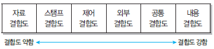
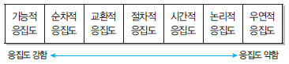

# 서버 프로그램 구현
## 개발 환경 구축 - 하드웨어 환경
 - 웹 서버 : 클라이언트로부터 직접 요청을 받아 처리하는 서버로, 저용량의 정적 파일들을 제공
 - 웹 애플리케이션 서버 : 사용자에게 동적 서비스를 제공하기 위해 웹 서버로부터 요청을 받아 데이터 가공 작업을 수행하거나, 웹 서버와 
   데이터베이스 서버 또는 웹 서버와 파일 서버 사이에서 인터페이스 역할을 수행하는 서버
 - 데이터베이스 서버 : 데이터베이스와 이를 관리하는 DBMS를 운영하는 서버 
 - 파일 서버 : 데이터베이스에 저장하기에는 비효울적이거나, 서비스 제공을 목적으로 유지하는 파일들을 저장하는 서버
## 개발 환경 구축 - 소프트웨어 환경
- 소프트웨어 환경은 클라이언트와 서버 운영을 위한 시스템 소프트웨어와 개발에 사용되는 개발 소프트웨어로 구성된다.
- 시스템 소프트웨어에는 운영체제, 웹 서버 및 WAS운용을 위한 서버 프로그램, DBMS등이 있다. 
- 개발 소프트웨어에는 요구사항 관리 도구, 설계/모델링도구, 구현 도구, 빌드 도구, 테스트 도구, 형상 관리 도구 등이 있다.
    * 요구사항 관리 도구 : 요구사항의 수집과 분석, 추적 등을 편리하게 도와주는 소프트웨어
    * 설계/모델링 도구 : UML을 지원하며, 개발의 전 과정에서 설계 및 모델링을 도와주는 소프트웨어
## 모듈
- 모듈화를 통해 분리된 시스템의 각 기능들로, 서브루틴, 서브시스템, 소프트웨어 내의 프로그램, 작업 단위 등과 같은 의미로 사용된다.
    * 모듈화 : 소프트웨어의 성능을 향상시키거나 시스템의 수정 및 재사용,우지 관리 등이 용이하도록 시스템의 기능들을 단위로 분해하는 것으로 
      모듈 간 결합도의 최소화, 응집도의 최대화가 목표임.
- 모듈의 기능적 독릭성은 소프트웨어를 구성하는 각 모듈의 기능이 서로 독립됨을 의미하는 것으로, 모듈이 하나의 기능만을 수행하고 다른 모듈과의 
  과도한 상호작용을 배제함으로써 이루어진다.
- 독립성이 높은 모듈일수록 모듈을 수정하더라도 다른모듈들에게는 거의 영향을 미치지 않으며, 오류가 발생해도 쉽게 발견하고 해결할 수 있다.
- 모듈의 독립성은 결합도와 응집도에의해 측정되며, 독립성을 높이려면 모듈의 결합도는 약하게, 응집도는 강하게, 모듈의 크기는 작게 만들어야 한다.
## 결합도(Coupling) (자스제외공내)
- 모듈간에 상호 의존하는 정도 또는 두 묘듈 사이의 연관 관계를 의미한다.
- 다용한 결합으로 모듈을 구성할 수 있으나 결합도가 약할수록 품질이 높고, 강할수록 품질이 낮다.
- 결합도가 강하면 시스템 구현 및 유지보수 작업이 어렵다.
- 결홉도의 종류에는 자료 결합도, 스탬프 결합도, 제어 결합도, 외부 결합도, 공통 결합도, 내용 결합도가 있으며 결합도의 정도는 다음과 같다.

- 자료 결합도 : 모듈 간의 인터페이스가 자료 요소로만 구성될 때의 결합도
- 어떤 모듈이 다른 모듈을 호출하면서 매개변수나 인수로 데이터를 넘겨주고, 호출받은 모듈은 받은 데이터에 대한 처리 결과를 다시 돌려주는 방식
- 스탬프 결합도 : 모듈 간의 인터페이스로 배열이나 레코드 등의 자료 구조가 전달될 때의 결합도
- 제어 결합도 : 어떤 모듈이 다른 모듈 내부의 논리적인 흐름을 제어하기 위해 제어 신호를 이용하여 통신하거나 제어 요소를 전달하는 결합도
- 외부 결합도 어떤 모듈에서 선언한 데이터를 외부의 다른 모듈에서 참조할 때의 결합도 
- 공통 결합도 : 공유되는 공통 데이터 영역을 여러 모듈이 사용할 때의 결합도
- 내용 결합도 : 한 모듈이 다른 모듈의 내부 기능 및 그 내부 자료를 직접 참조하거나 수정할 때의 결합도

## 응집도 (기순교절시논우)
- 정보 은닉 개념을 확장한 것으로, 명령어나 호출문 등 모듈의 내부 요소들의 서로 관련되어 있는 정도, 즉 모듈이 독립적인 기능으로 정의되어있는 
  정도를 의미한다.
- 다양한 기준으로 모듈을 구성할 수 있으나 응집도가 강할수록 품질이 높고, 약할수록 품질이 낮다.

- 기능적 응집도 : 모듈 내부의 모든 기능 요소들이 단일 문제와 연관되어 수행될 경우의 응집도
- 순차적 응집도 : 모듈 내 하나의 활동으로부터 나온 출력 데이터를 그 다음 활동의 입력 데이터로 사용할 경우의 응집도
- 교환적 응집도 : 동일한 입력과 출력을 사용하여 서로 다른 기능을 수행하는 구성 요소들이 모였을 경우의 응집도
- 절차적 응집도 : 모듈이 다수의 관련 기능을 가질 때 모듈안의 구성 요소들이 그 기능을 순차적으로 수행할 경우의 응집도
- 시간적 응집도 : 특정 시간에 처리되는 몇 개의 기능을 모아 하나의 모듈로 작성할 경우의 응집도 
- 논리적 응집도 : 유사한 성격을 갖거나 특정 형태로 분류되는 처리 요소들로 하나의 모듈이 형성되는 경우의 응집도
- 우연적 응집도 : 모듈 내부의 각 구성 요소들이 서로 관련 없는 요소로만 구성된 경우의 응집도

## 팬인/ 팬 아웃
## 공통 모듈
- 여러 프로그램에서 공통적으로 사용할 수 있는 모듈을 의미한다.
- 자주 사용되는 계산식이나 매번 필요한 사용자 인증과 같은 기능들이 공통 모듈로 구성될 수 있다.
- 정확성 : 시스템 구현 시 해당 기능이 필요하다는 것을 알 수 있도록 정확히 작성
- 명확성 : 해당 기능을 이해할 때 중의적으로 해석되지 않도록 명확하게 작성
- 완전성 : 시스템 구현을 위해 필요한 모든 것을 기술
- 일관성 : 공통 기능들 간 상호 충돌이 발생하지 않도록 작성
- 추적성 : 기능에 대한 요구사항의 출처, 관련 시스템 등의 관계를 파악할 수 있도록 작성
## 프레임워크의 특징
- 모듈화 : 프레임워크는 캡슐화를 통해 모듈화를 강화하고 설계 및 구현의 변경에 따른 영향을 최소화함으로서 소프트웨어의 품질을 향상시킨다.
- 재사용성 : 프레임워크는 재사용 가능한 모듈들을 제공함으로써 개발자의 생산성을 향상시킨다.
- 확장성 : 프레임워크는 다형성을 통한 인터페이스 확장이 가능하며 다양한 형태와 기능을 가진 애필리케이션 개발이 가능하다. 
- 제어의 역전(Inversion of Control) : 개발자가 관리하고 통제해야 하는 객체들의 제어 권한을 프레임워크에 넘김으로써 생산성을 향상시킨다.
